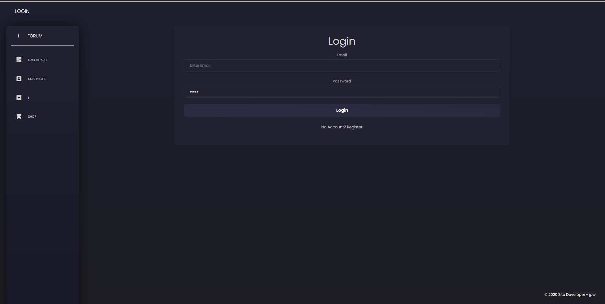
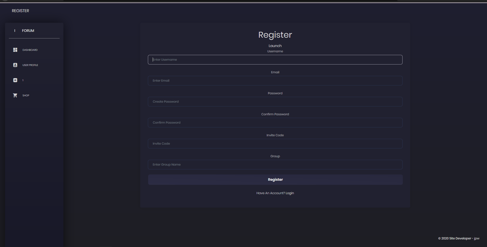
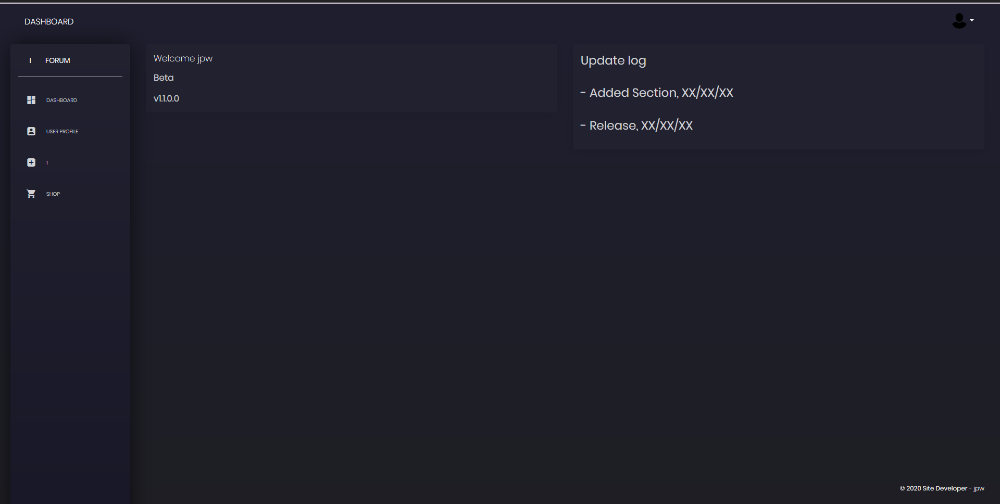
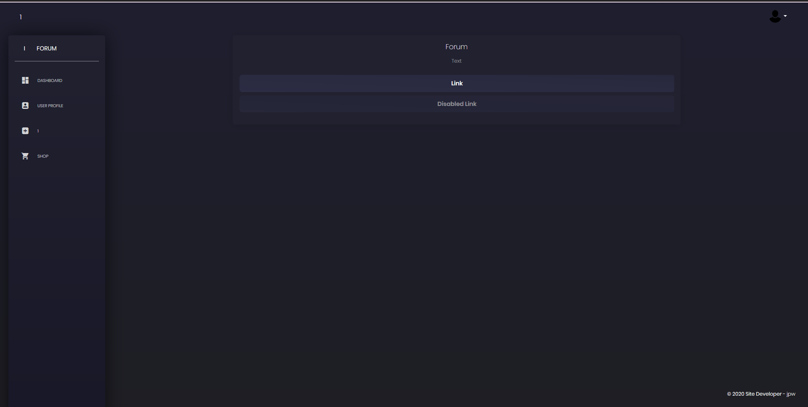
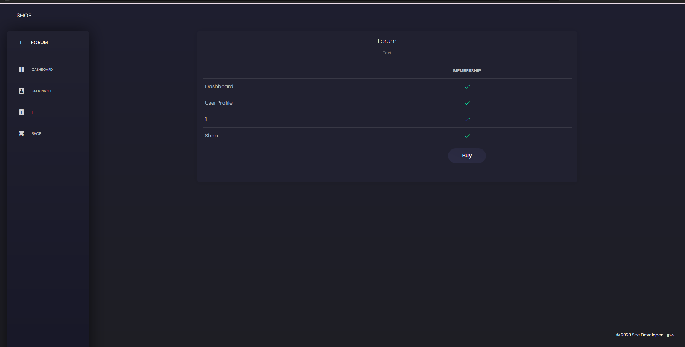

# Full-Login-Dashboard-With-Invite-System-Node.js-Express.js-Passport.js-MongoDB
Full Login/Reg Dashboard With Authentication And Invite System

- How to use

- Make a MongoDB Account Here https://www.mongodb.com/ Then create a cluster, whitelist your ip, connect it using the 2nd option on
connect, put your connection string in config/keys

- Install Node.js and a IDE

- Create a terminal

- npm i

- npm start

- Previews

